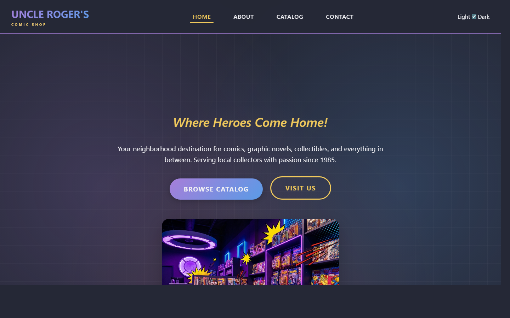

# Uncle Roger's Comic Shop

A multi-page marketing site for a fictional local comic book shop, built as the Week 5 micro-iteration project for DIG4503. The site features a full light/dark mode toggle that respects user preference and OS settings, a filterable product catalog rendered from a JavaScript array, and a contact form with topic selection.

## Pages

- **Home** — Hero, "Why Collectors Choose Us" features, weekly events, CTA
- **About** — Company story, timeline of the shop's history, team bios, mission
- **Catalog** — Filterable grid of 15 comics across 5 categories (new releases, vintage, graphic novels, manga, collectibles)
- **Contact** — Store info, contact form with topic selector, store hours, FAQ

## Tech Stack

- HTML, CSS, vanilla JavaScript (no framework)
- Light/dark theme persisted in `localStorage`, with OS-preference fallback via `prefers-color-scheme`
- Catalog rendered client-side from a JS array with category filtering

## Setup

Open [`index.html`](index.html) in any modern browser. No build tools or dependencies required.

## What I Added in Week 5

The Week 5 assignment was to use **micro-iteration with self-review** to add a single feature to an existing site. The feature I added was the light/dark mode toggle:

- A switch in the top-right of the navbar on every page
- Theme persists across sessions via `localStorage`
- Respects `prefers-color-scheme` on first visit
- Updates live if the user changes their OS theme (unless they've made a manual choice)
- A `no-transition` class is applied during page load to prevent a brief flash on initial render

See [PROCESS.md](PROCESS.md) for the full process write-up.

## Known Limitations

- Social and "Get Directions" links go to `#` placeholders
- Contact form has no backend; it submits to `#`
- Map section uses a static image rather than an embedded interactive map
- Theme toggle and mobile-menu scripts are duplicated inline at the bottom of each page (would be cleaner extracted into a shared `script.js`)

## What I'd Improve

- Extract the duplicated inline scripts into a single `script.js` file
- Replace the `onclick="toggleMenu()"` inline handler with an `addEventListener` setup
- Wire the contact form to a service like Formspree
- Replace the map placeholder with an embedded Google Map
